# Description

A responsive landing page for BetKing - an online casino featuring games, bonuses, and promotions. This website also has several sections like Features, Reviews or FAQs, a responsive design, mobile-only elements and a mascot in the form of a casino roulette.

## Sections Included

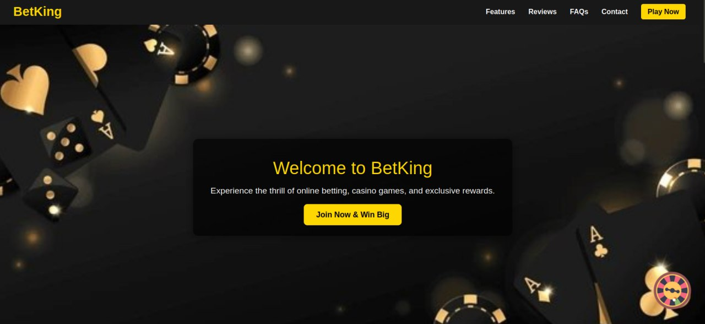
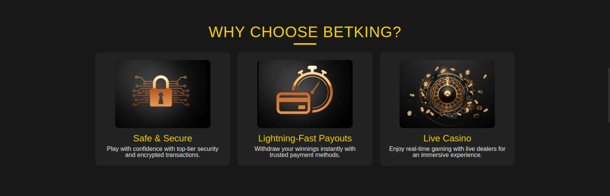
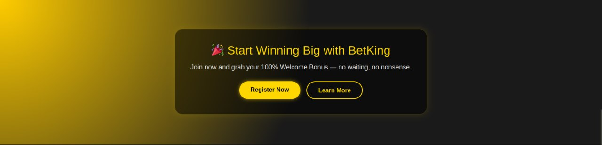
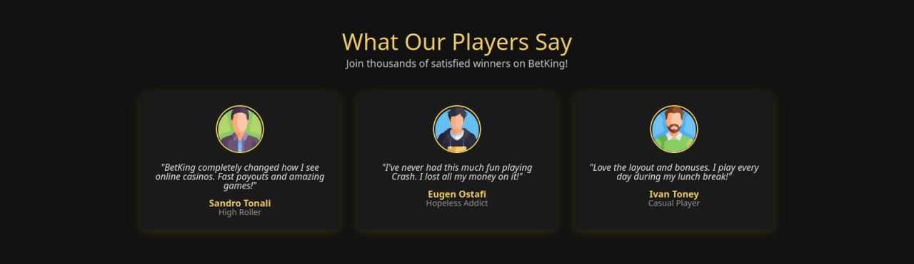
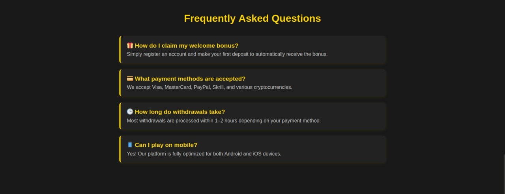
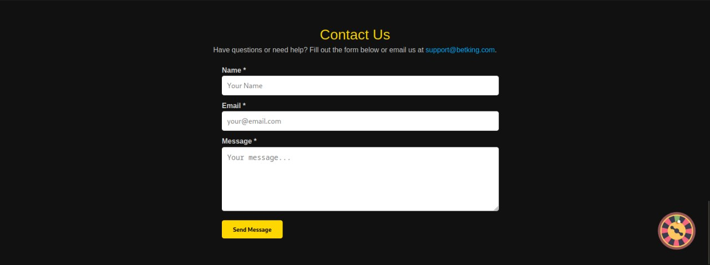

## Mobile Responsiveness

We also had to implement mobile responsiveness for our website, as well as a mobile-only element. Below are the results:

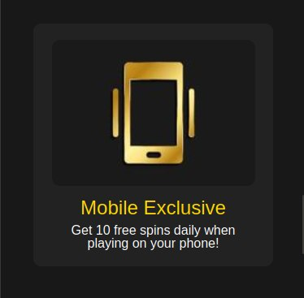
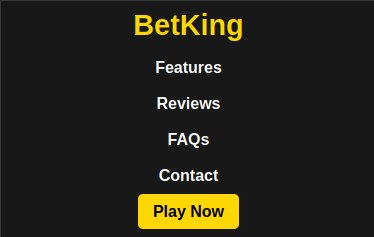
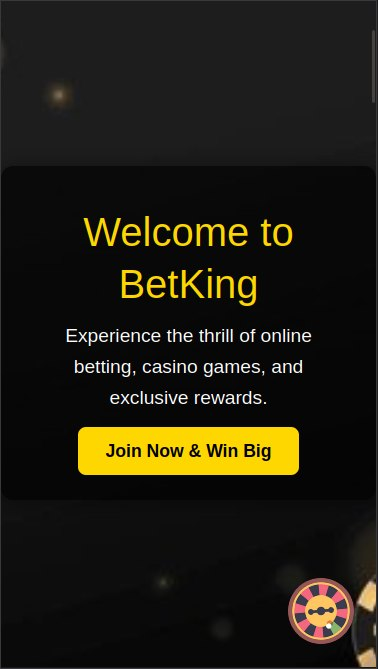
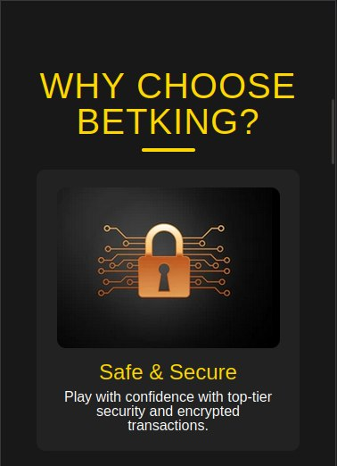
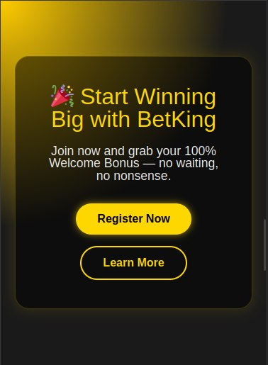
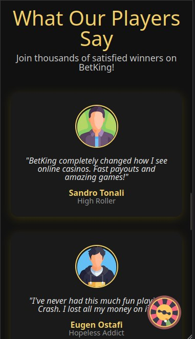
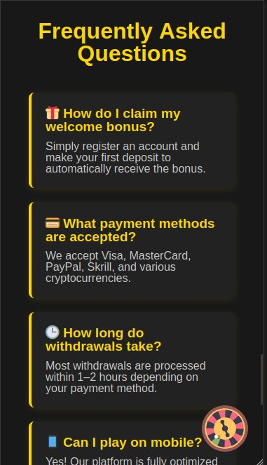
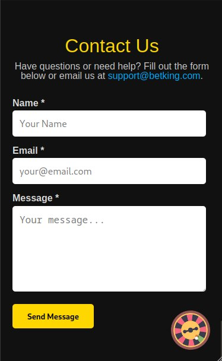

## Mascot

A requirement for our app was to implement an animated mascot that is related to our chosen topic and that displays a message upon hovering it. As my website is casino-themed I opted for a roulette that rotates as my mascot, and that displays a CTA message upon hovering it.

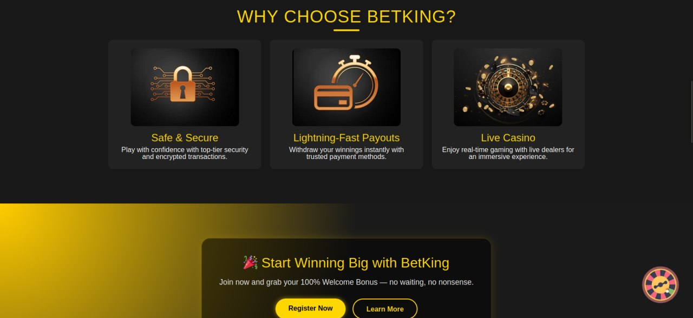
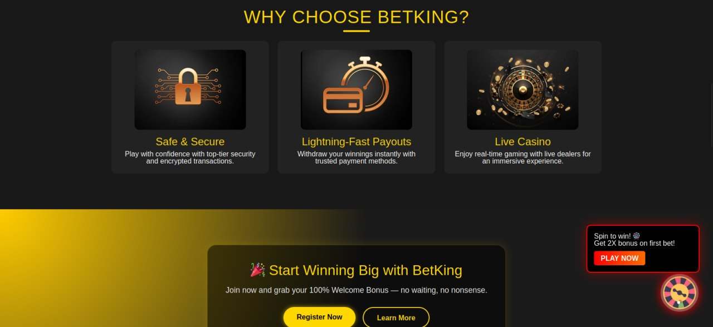

## Live Demo

[Deployed Github Pages Link] https://renat03.github.io/tum-web-lab2/